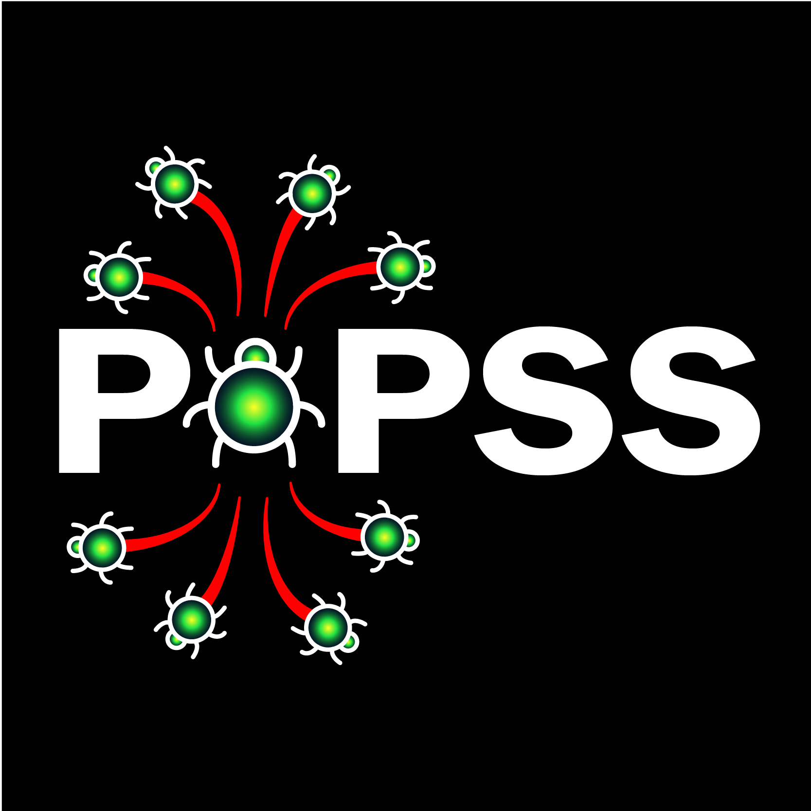

# PoPSS
Pest or Pathogen Spread Simulation

This model is being established as a partnership between NC State University and the US Forest Service's APHIS program. The goal is to build a generalizable framework for modeling pest and pathogen spread and introduction in both forest and agricultural ecosystems.A GUI is being developed for user to interact with the model for data upload and parameter changes.
